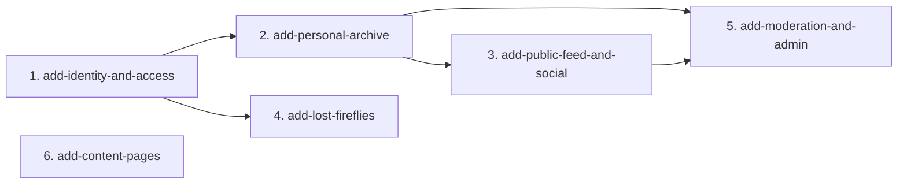

# MVP Capability Change Plan

**Step 4 of the SDD process** — the MVP is split into 6 capability slices.
All 6 were implemented in a single bootstrapping pass (retrofitted baseline).
Future work runs through the full gated loop (spec → tests(red) → implement(green) → review-gate → archive).

> Source: `docs/requirements.md`, `docs/prd.md`, `openspec/specs/`

## 1. Slicing principles

1. One slice ≈ one cohesive capability, sized to design/build/test/archive as a unit.
2. Dependency-respecting order — foundations first.
3. One owner per requirement — every MVP FR assigned to exactly one slice.
4. Baseline-spec aligned; multiple specs bundled only when tightly coupled.
5. Naming: kebab-case `add-<capability>` under `openspec/specs/`.

## 2. The capability slices

| # | Change name | MVP FRs | Depends on | Status |
|---|---|---|---|---|
| 1 | `add-identity-and-access` | FR-AUTH-01–05, FR-SHELL-01–04 | — | retrofitted |
| 2 | `add-personal-archive` | FR-MEM-01–06, FR-TOPIC-01–02, FR-CITY-01 | 1 | retrofitted |
| 3 | `add-public-feed-and-social` | FR-FEED-01–07, FR-TOPIC-02, FR-CITY-02 | 2 | retrofitted |
| 4 | `add-lost-fireflies` | FR-LOST-01–05 | 1 | retrofitted |
| 5 | `add-moderation-and-admin` | FR-MOD-01–05 | 1, 2, 3 | retrofitted |
| 6 | `add-content-pages` | FR-CONTENT-01–02 | — | retrofitted |

**Cross-cutting NFRs every slice honors:** NFR-SEC-01, NFR-I18N-01, NFR-A11Y-01, NFR-OBS-01, BC-BRAND-01 (no exclamation marks), BC-PRIVACY-01.

## 3. Dependency graph

**Critical path:** 1 → 2 → 3 → 5. Slices 4 and 6 are independent after slice 1.

## 4. Per-slice scope

### 4.1 `add-identity-and-access`

- **Scope in:** User entity, registration, login, JWT auth, profile view/edit, protected routes, header with user state
- **Scope out:** Email confirmation (post-MVP), OAuth, password reset
- **DB:** `users` table (V1 migration)
- **Done when:** POST /api/auth/register, POST /api/auth/login, GET /api/auth/me, PUT /api/users/me all pass; JWT filter guards protected routes; FE /register, /login, /profile work with real API

### 4.2 `add-personal-archive`

- **Scope in:** Memory CRUD (story + recipe), media upload, dashboard with filters, single memory page
- **Scope out:** Multiple photos per memory, video
- **DB:** `memories`, `media` tables (V2 migration)
- **Done when:** Full CRUD at /api/memories; file upload to /uploads; FE dashboard + form + detail pages work

### 4.3 `add-public-feed-and-social`

- **Scope in:** Public feed with city/topic/sort filters, likes (Warmth), comments
- **Scope out:** Nested comments, notifications
- **DB:** `likes`, `comments` tables (V3 migration)
- **Done when:** GET /api/feed returns public memories; POST /api/likes toggles; comments CRUD works; FE feed page renders with filters

### 4.4 `add-lost-fireflies`

- **Scope in:** Lost requests CRUD (public read, auth create), city/type filters, detail with mailto
- **Scope out:** Replies/threads on lost requests
- **DB:** `lost_requests` table (V4 migration)
- **Done when:** GET /api/lost-requests with filters, POST /api/lost-requests, GET /api/lost-requests/:id; FE /lost, /lost/new, /lost/:id work

### 4.5 `add-moderation-and-admin`

- **Scope in:** Reports (create), admin panel (list reports, delete content, ban users), role-based access
- **Scope out:** Automated moderation, email notifications to moderators
- **DB:** `reports` table (V5 migration); `role` + `is_banned` columns in `users`
- **Done when:** POST /api/reports; GET/actions at /api/admin/*; FE /admin page works for role=admin

### 4.6 `add-content-pages`

- **Scope in:** Static /about and /rules pages
- **Scope out:** CMS-driven content
- **Done when:** Both pages render correct Ukrainian text, accessible, no console errors

## 5. FR coverage check

| FR | Slice | FR | Slice | FR | Slice |
|---|---|---|---|---|---|
| FR-SHELL-01 | 1 | FR-MEM-01 | 2 | FR-FEED-01 | 3 |
| FR-SHELL-02 | 1 | FR-MEM-02 | 2 | FR-FEED-02 | 3 |
| FR-SHELL-03 | 1 | FR-MEM-03 | 2 | FR-FEED-03 | 3 |
| FR-SHELL-04 | 1 | FR-MEM-04 | 2 | FR-FEED-04 | 3 |
| FR-AUTH-01 | 1 | FR-MEM-05 | 2 | FR-FEED-05 | 3 |
| FR-AUTH-02 | 1 | FR-MEM-06 | 2 | FR-FEED-06 | 3 |
| FR-AUTH-03 | 1 | FR-TOPIC-01 | 2 | FR-FEED-07 | 3 |
| FR-AUTH-04 | 1 | FR-TOPIC-02 | 2 | FR-CITY-02 | 3 |
| FR-AUTH-05 | 1 | FR-CITY-01 | 2 | FR-LOST-01 | 4 |
| FR-MOD-01 | 6 | FR-LOST-02 | 4 | FR-LOST-03 | 4 |
| FR-MOD-02 | 5 | FR-LOST-04 | 4 | FR-LOST-05 | 4 |
| FR-MOD-03 | 5 | FR-MOD-04 | 5 | FR-MOD-05 | 5 |
| FR-CONTENT-01 | 6 | FR-CONTENT-02 | 6 | — | — |

**Total: 37 MVP FRs across 6 slices (no gaps, no duplicates).**

## 6. Note on retrofitted status

All 6 slices were implemented in a bootstrapping pass before the gated loop was applied.
They are marked `retrofitted` in `openspec/project.md` and in `.project-factory/retrofit.json`.
Evidence for these slices is **retrofitted, not earned red-first** — historical test-first
ordering cannot be reconstructed. Future slices run the full loop from the start.

