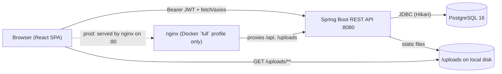

# Architecture

Svitlyachok (Світлячок) is a two-tier web app: a React SPA calling a stateless
REST API, backed by a single PostgreSQL database. No message queue, cache, or
third-party integration exists in the MVP — see `integrations.md`.

## Components

| Component | Tech | Location |
|---|---|---|
| Frontend | React 19.2, Vite 8.1, TypeScript 6.0, react-router-dom 7 | `firefly-fe/` |
| Backend | Kotlin 2.3.21, Spring Boot 4.1.0, Java 25 target | `firefly-be/` |
| Database | PostgreSQL 16 (Docker: `postgres:16-alpine`) | schema via Flyway |
| Migrations | Flyway, `ddl-auto=validate` (Hibernate never mutates schema) | `firefly-be/src/main/resources/db/migration/` |
| Local/deploy orchestration | Docker Compose, two profiles | `docker-compose.yml` |

## Request flow

- In dev, `pnpm dev` (Vite) proxies `/api` to `localhost:8080`; in the `full`
  Docker profile, `firefly-fe/Dockerfile` builds a static bundle served by
  nginx, which reverse-proxies `/api` and `/uploads` to the `backend`
  container and allows up to `10m` request bodies (memory photo uploads).
- The backend is fully stateless — no server-side session store, no sticky
  sessions needed. Every request re-derives identity from the JWT
  (`config/JwtFilter.kt`). See `auth-and-access.md`.
- Uploaded photos are written to `app.upload.dir` (default `./uploads`) and
  served back by Spring's static resource handler
  (`config/WebConfig.kt`) at `/uploads/**` — see `integrations.md` for the
  caveats of this being the app's only "integration-like" surface.

## Backend module layout

One Kotlin package per domain under `firefly-be/src/main/kotlin/com/firefly/fireflybe/`:
`auth`, `users`, `memories`, `feed`, `comments`, `likes`, `lost`, `reports`,
`admin`, `health`, plus cross-cutting `config/` (security, JWT, rate
limiting, upload static serving) and `common/` (shared `ApiException` +
`GlobalExceptionHandler`). Each domain package typically has an entity, a
`*Repository` (Spring Data JPA), a `*Service` (business rules), a
`*Controller` (HTTP mapping), and `*Dtos.kt` (request/response shapes +
validation annotations) — see `apis-and-actions.md` for the full route list
and `data-model.md` for the entities.

## Frontend module layout

`firefly-fe/src/`: `pages/` (one file per route, thin — data fetching via
`api/*.ts` and shared hooks), `api/` (one file per backend domain plus
`client.ts` — the shared axios instance — and `token.ts` — localStorage JWT
storage), `design-system/` (the shared component library, see `DESIGN.md`),
`contexts/`, `hooks/`, `locales/` (`uk/*.json`, react-i18next — see
NFR-I18N-01/02 in `docs/requirements.md`).

## Why this shape

- **Stateless JWT over session cookies**: simplifies horizontal scaling (no
  sticky sessions / shared session store needed) at the cost of the
  localStorage-token tradeoffs documented in `auth-and-access.md` and
  `docs/qa/risk-register.md` Risk S10.
- **Flyway + `ddl-auto=validate`**: the database schema is only ever changed
  by a committed, numbered SQL migration (`V1`–`V5` today); Hibernate is
  forbidden from auto-generating DDL, so `data-model.md`'s schema is always
  traceable to a file in git.
- **No profile-based config split (dev/test/prod)**: everything currently
  runs on the same `application.properties` defaults unless env vars
  override them — this is why the JWT-secret placeholder could not be made
  fail-fast (see `auth-and-access.md`) and why `operations.md` is explicit
  about which env vars MUST be overridden before a real deployment.

## Related

- `data-model.md` — entities and schema.
- `auth-and-access.md` — JWT lifecycle, security filter chain, residual risks.
- `apis-and-actions.md` — full REST surface.
- `operations.md` — running locally / in Docker, env vars, health check.
- `openspec/specs/` — accepted behavior specs per capability.
- `docs/adr/` — architecture decisions, if any supersede the above.
